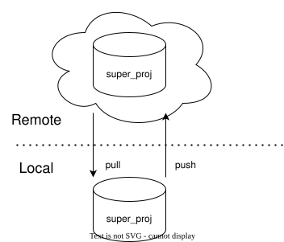
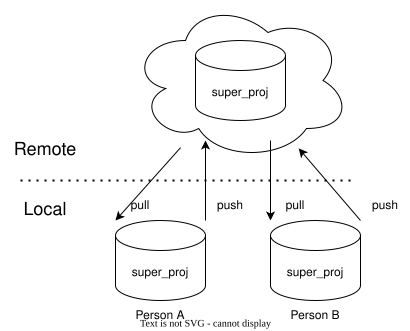
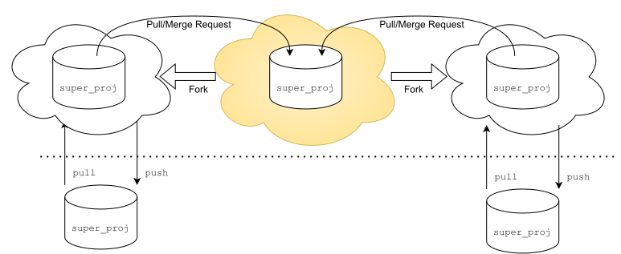

<!-- 
_class: title_slide
_paginate: skip
-->

# <!--fit-->COMP 3700A: Contributing to Open Source
### <!--fit-->Exploring OSS projects

Charlotte Curtis
September 14, 2026

---

## Today's Goals
- Understand a bit more about Git
- Look at the projects you shared for homework:
  - Common documents
  - Project activity
  - Communication channels

**References**:
- "Open Source: What It Is and How to Contribute" — [Chapter 4 (Git)](https://runestone.academy/ns/books/published/opensource/ch_git.html?mode=browsing)

---

## Housekeeping
- Lab grades will be updated on D2L out of seven
- Lab deadlines now made explicit on [labs README](https://github.com/mru-open-source/f26/tree/main/labs), with extensions for first two
- [Project part 1](https://github.com/mru-open-source/f26/tree/main/project/part1.md) is now published
  > I asked Gemini and it was completely willing to invent answers. Please don't waste my time (and yours) outsourcing this to an LLM.

---

## Single user, single branch

<div class="columns">

- `init` or `clone` to get repo
- For each commit:
  ```bash
  git add whatever changed
  git commit -m "Short message \
    describing change"
  ```
- Other useful commands:
  ```bash
  git status
  git log
  git reset
  ```



</div>

---

## Single user, multiple branches

- `git checkout -b dev` (shortcut for `git branch dev && git checkout dev`)
- `git checkout main`
- `git merge dev`



---

## Adding a remote

<div class="columns">



- `git remote add <remote_name> <url>`
- If you cloned from URL at the start, the remote `origin` should exist
- `git remote -v` shows all defined remotes and their roles

</div>

---

## Multiple users, single remote, single branch

<div class="columns">



- Same commands, but now risk of **merge conflicts**
- Might need `git rebase`
- `git pull` is actually short for `git fetch` then `git merge` *or* `git rebase`, depending on configuration

</div>

---

## Multiple users, multiple forks, single branch



---

## <!-- fit --> Multiple users, multiple forks, multiple branches 
- The most common setup in FOSS development
- One "canonical" repo, each developer has a fork
- Pull/merge requests (PRs) are **branch-specific**
  - Updates to a branch with an open PR will be added to the PR
  - Typical workflow: create a new branch for every new feature/bug fix

> This is where I had you jump into the deep end last Thursday

---

## Exploring communities
- With the projects you posted on the last [homework discussion](https://github.com/mru-open-source/f26/discussions/1):
  - What are some common documents?
  - How do you evaluate project activity?
  - How is communication handled?

> **Homework**: Stay tuned while I create issues for content to create and review